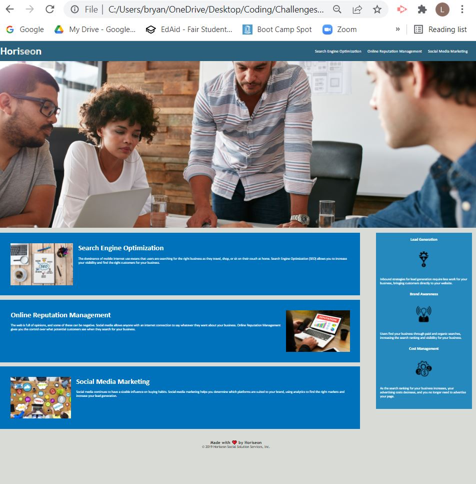

# Horiseon

[Deployed Website](https://renbryant.github.io/Horiseon/)

This is a website for the Horiseon Social Solution Services. This repository shows my stages to clean up the code and make sure all of the links, images, and icons work in the code and on the website itself. The website is supposed to be easily accessible and visually appealing. Here is what I did:

Changed semantice HTML elements from 
 to the names of specific elements
    -header
    -footer
    -aside
    -article
    -main
    -nav

Fixed the search optimization link by adding the HTML semantic "id" with the correct direction. That way a consumer can click on the naviagtion bar and be taken to the correct content they are looking for.

Added alternate image attributes for the main pictures, as well as the icons, to make the website easily accessible.

Updated heading attribute at the bottom of the html file so there is no repeat of the same heading semantic on a different line as to not confuse the .css code.

Changed the title of the webpage to a website name to be more descriptive to viewers of the site who might have multiple tabs open.

Fixed the .css for the .nav so that the navigation bar is visually appealing.